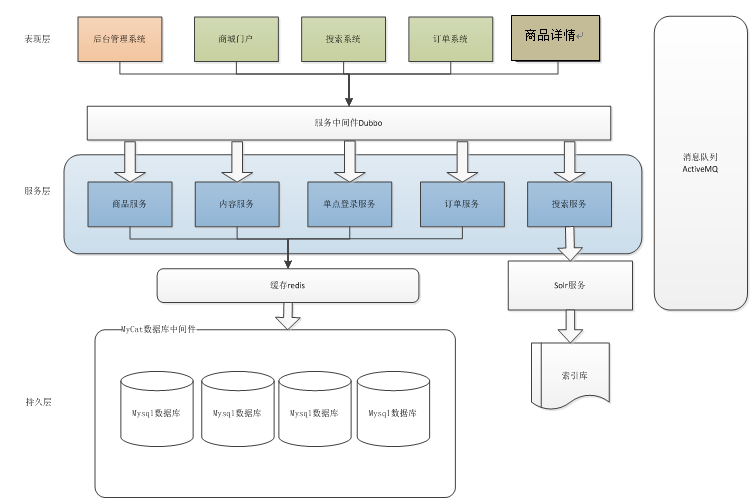

# taotaogou商城项目 #
##### 项目介绍 #####

&emsp;该项目是一个电子商城，采用springMVC+spring+Mybatis框架实现，基于SOA架构，把工程拆分成服务层工程、表现层工程，服务层工程包含业务逻辑，只需对外提供服务。表现层只需处理和页面的交互，业务逻辑通过调用服务层的服务来实现。

##### 商城系统架构 #####

##### 项目的工程结构 #####
taotaogou-parent:父工程，打包方式pom，管理jar包版本。   
&ensp;&ensp;|--项目中所有工程都继承父工程。   
&ensp;&ensp;|--taotaogou-common:通用的工具类、通用的pojo、util，打包方式jar。    
&ensp;&ensp;|--taotaogou-manager:服务层工程，聚合工程，打包方式pom。  
&ensp;&ensp;&ensp;&ensp;|--taotaogou-manager-dao:数据持久层模块，打包方式jar。  
&ensp;&ensp;&ensp;&ensp;|--taotaogou-manager-pojo:实体类，打包方式jar。  
&ensp;&ensp;&ensp;&ensp;|--taotaogou-manager-interface:服务层接口，打包方式jar。  
&ensp;&ensp;&ensp;&ensp;|--taotaogou-manager-service:服务层接口的实现类，发包方式war。  
&ensp;&ensp;|--taotaogou-manager-web:表现层工程，打包方式war。
##### 技术选型 #####

*  Spring SpringMVC Mybatis

*  JSP JSTL jQuery EasyUI KindEdit(富文本编辑器)

*  Redis(缓存服务器、单点登录、购物车)

*  Solr(搜索）

*  dubbo(分布式服务框架)

*  HttpClient(Http协议访问客户端）

*  ActiveMQ(消息队列）

*  Quartz(定时任务）

*  FastDFS(图片服务器）

*  FreeMarker(网页静态化)

*  Nginx(反向代理服务器）

*  MyCat(数据库中间件）

##### 开发工具版本和环境 #####

* IntelliJ IDEA 2017.3.4

* Maven 3.6.0

* Tomcat 8.5.24

* JDK 1.8

* MySql 5.6.40

* Dubbo 2.5.3

* Nginx 1.8.0

* Redis 3.0.0

* ActiveMQ 5.13.0
##### 友好提示 #####
&emsp;如果项目里面出现任何问题可以提出来，或者有什么改进的地方也可以提出来，本人是新手，希望得到更多的建议，咱们共同进步，如果长时间没有回复，可以发送邮件到keminapera@163.com，看到必回。
